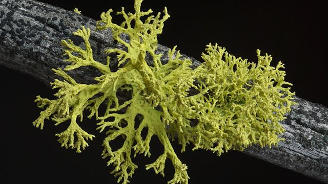

```{r setup, include=FALSE}
library(learnr)
library(mosaic)
sppcount <- read.csv("Data/sppcount.csv")
lichens_dat  <- read.csv("Data/lichen.csv")
knitr::opts_chunk$set(echo = FALSE)
```


## Introduction
### Linear models
In the last two weeks, we have been looking at linear models using `lm()`. The
response data you've looked at has been continuous numerical data, potentially with 
decimal points.

### Data types
Your response variable may not always be a continuous numerical one. In biology
you may be dealing with the numbers of birds in a wood
(whole numbers), percentage of crop damage by a pathogen (bounded 0 to 100) or
dead/alive (categorical data). Thinking about your data type allows you to 
improve your standard linear model with a "generalised" linear model that can
cope with these types of responses:

* **Continuous data**
  * These could be positive or negative, and include decimal points, 2.45, 5.01,
  -3.78, 2.00. Examples might include temperate (degrees Centigrade).
* **Whole number data, bounded by zero**
  * These are often count data, 4, 12, 0, 234. Examples might include the number
  of hedgehogs seen at a site.
* **Proportion or percentage data, 0 to 1, or 0 to 100**
  * These values can have decimals, but are bounded between 0 and 1 (or 0 and 100
  for percentages). Usually analysed as proportions. 0.23, 0.15, 0.98 etc. Can
  arise in lots of experiments, e.g. proportion of insects killed by a new pesticide
* **Binary categorical data**
  * Two categories present, often coded as 0 or 1. Again wide occurrence in 
  biology: dead/alive, present/absent, resistant/susceptible etc.

## Assumptions of linear model
Linear models assume that our response is a continuous numerical variable, and the model produces normally-distributed residuals with homogeneity of variance. Continuous numerical data can take any value, could be either positive and negative and run from -infinity to +infinity. Thus our model is of the form:

$\text{Response variable} = \text{Explanatory variable(s)} + Error$

and when your response is a continuous numerical variable then it is assumed that
a histogram of your errors would produce a normal (Gaussian) or bell-shaped curve. 

### Three key types of error distribution
When we move from a linear model to using a GLM, we will need to think about changing the distribution we use or are assuming from our data. If we undertake a GLM using a Gaussian distribution this is very similar to just doing a linear model. The reason to switch to a GLM is because it allows us to work in a generalised framework with other distributions. The two other distributions you are most likely to need as biologists are the Poisson distribution for counts named after Simeon Poisson (French mathematician), and the Binomial distribution for proportion 1/0 or presence/absence data (no-one seems to have claimed credit for this one!).

* Gaussian (normal) distribution: classic bell-shaped curve, used for **continuous** response
* Poisson distribution: **whole number count** response
* Binomial distribution: **proportion** or a **binary categorical** response

### Generalised linear models
These are an extension of the standard linear model that you have already used.
They are called with the `glm()` function, and can handle Gaussian, Poisson and
Binomial error distributions. Before we look in detail at how `glm()` work, we
will refresh our memory on the Gaussian (normal) distribution, and introduce
the Poisson and Binomial distributions using interactive controls.

Let’s have a quick look at all three distributions and hopefully this will become clearer.

## Normal distribution

This statistical distribution is named after a 19th Century German mathematician,
Friederick Gauss. There are two 'parameters' to a normal
distribution, the mean and the standard deviation. Conveniently, 95% of the
data will fall within + or - 1.96 (i.e. approximately 2) standard deviations.

The interactive tool below will let you change the mean and the standard deviation so you can see how these two parameters alter the position along the x-axis and shape of the normal distribution alogn the x- and y-axes. The blue line represents a fitted curve over the histogram according to the Gaussian distribution which will help you visualise the bell-shape.

```{r gaussian_distribution_ui, echo=FALSE}
    titlePanel("The normal (Gaussian) distribution")

    sidebarLayout(
        sidebarPanel(
            sliderInput("mean",
                        "Mean",
                        min = 0,
                        max = 100,
                        value = 50),
            sliderInput("sd",
                        "Standard deviation",
                        min = 0.1,
                        max = 10,
                        value = 5)
        ),

        mainPanel(
           plotOutput("gauss_plot")
        )
    )
```
```{r gaussian_distribution_server, context="server"}
output$gauss_plot <- renderPlot({
  gf_dhistogram(~ rnorm(n=100, mean=input$mean, sd=input$sd), bins = 20) %>% 
    gf_dist("norm", params = list(mean=input$mean, sd=input$sd), colour = "blue") %>% 
    gf_lims(x = c(0, 100), y = c(0, 0.15)) %>% 
    gf_labs(x = "Value of random normal variable",
            y = "Density (proportion of values)")
})
```

**Comments**
You should have seen the following changes to the plot when you adjusted the mean and standard deviation:

* as you increase or decrease the mean, the distribution moves to the left or the right, but remains roughly the same shape
* a low standard deviation results in the values being packed together while a high standard deviation flattens and spreads the curve

 
## Poisson distribution
Often biologists and ecologists collect data in the form of counts e.g. the number of birds in wood, or number of bacterial colonies on a Petri dish. These numbers are whole numbers or integers and cannot be negative values or have decimal points. This means that our distribution cannot include numbers less than zero. The Poisson distribution allows us to model count data. It takes a parameter $\lambda$ (Greek letter lambda) which adjusts the shape of this distribution. Try mvoing the the interactive slider left and right to see what happens to the size and shape of the distribution:

```{r poisson_distribution_ui, echo=FALSE}
    titlePanel("The Poisson distribution for whole-number counts")

    sidebarLayout(
        sidebarPanel(
          withMathJax(),
            sliderInput("lambda",
                        "\\(\\lambda\\) (lambda)",
                        min = 1,
                        max = 100,
                        value = 50)
        ),

        mainPanel(
           plotOutput("poiss_plot")
        )
    )

```

```{r poisson_distribution_server, context="server"}
output$poiss_plot <- renderPlot({
    gf_dist("pois", params = list(lambda=input$lambda)) %>% 
    gf_lims(x = c(0, 100), y = c(0, 0.15)) %>% 
    gf_labs(x = "Value of random Poisson (count) variable",
            y = "Density (proportion of values)")
})
```

You should have seen the following things happen to the distribution when you moved the slider:

* When $\lambda$ is high, you'll see that the Poisson distribution
looks fairly similar to a normal distribution, except with whole numbers. However
as $\lambda$ gets smaller, the distribution gets ***squashed*** to the left, as
it cannot have any values below zero.
* The histogram is shown slightly differently, as we are dealing with whole
number counts.

## Binomial distribution
There are times when you will collect data that has a binary response. This could be:

* dead / alive
* present / absent
* true / false
* proportion or percentage data

The main parameter is the probability of "success" on each "trial". So if you
toss a (fair) coin your probability of a head should be 0.5.  You might do an
experiment where you have 25 replicates, in each of which you try and germinate
10 seeds. The "size" of each replicate is 10, and you would have a count of
the numbers of seeds germinated or failed in each replicate.

Below, we have the simplest setup, 25 replicates, with each of size one (which
produces a very simple plot). Adjust the size of each replicate, which is
equivalent to the number of seeds per replicate in the example above, and the
probability of success, equivalent to the probability of germination.

In the interactive demonstration below, we have the simplest setup, 25 replicates, with each of size one (which produces a very simple plot). Before you adjust the sliders, the sample size is only 1 (e.g. one seed per) replicate, and the probability (of germination) is 0.5. Therefore roughly half of your 25 replicates will fall into the 0 (no germination) category, and half into the 1.0 (germination) category. Adjust the size of each replicate, which is equivalent to the number of seeds per replicate in this example, and the probability of success, equivalent to the probability of germination.

```{r binomial_distribution_ui, echo=FALSE}
    titlePanel("The binomial distribution")

    sidebarLayout(
        sidebarPanel(
            sliderInput("size",
                        "Size of each trial (e.g. number of seeds per replicate)",
                        min = 1,
                        max = 50,
                        value = 1),
            sliderInput("prob",
                        "Probability of success (e.g. probability of seed germination)",
                        min = 0,
                        max = 1,
                        value = 0.5)
        ),

        mainPanel(
           plotOutput("binom_plot")
        )
    )

```

```{r binomial_distribution_server, context="server"}
output$binom_plot <- renderPlot({
    gf_histogram(~rbinom(n=25, size=input$size, prob=input$prob)) %>% 
    gf_lims(x = c(-2, input$size+2), y = c(-1, 25)) %>% 
    gf_labs(x = "Binomial count (e.g. number of seeds germinating per replicate)",
            y = "Number of replicates in this category")
})
```

You should have observed the following:

* As you increase the number of seeds per replicate (maximum of 50) you will
see additional whole numbers appearing on the horizontal axis, representing
the numbers of successes (e.g. germinating seeds)
* the total of all the vertical axes is always 25, which is the total number
of replicates in this example.

## How to generalise
### How do generalised linear models extend the standard linear model?
You have already come across the basic syntax for linear models of:

$$Response = \text{Explanatory variable(s)} + Error$$
where your explanatory variables are typically treatments, or environmental
measures, and your $Error$ is unknown variation or noise. A linear model assumes
that the $Error$ is normally distributed. This makes it relatively simple to
make a link from predictions calculated from your explanatory variable(s) to
your response.

Take a simple example, such as a 'regression' linear model, where you have a
continuous response variable $y$ and a continuous explanatory variable $x$. The
form of the model can then be expressed as:

$$y = a + b.x + \epsilon$$

Where

* $y$ = response variable, measured on a continuous scale (decimals allowed)
* $x$ = explanatory variable, in a regression this is continuous
* $a$ = intercept (where the fitted regression line crosses the vertical axis)
* $b$ = gradient of fitted line
* $\epsilon$ = unknown variation or noise in your data

When you create a linear model, the `lm()` function estimates the intercept and
slope parameters, to predict the response values as accurately as possible. The
above equation is often written as:

$$y = \beta_0 + \beta_1x + \epsilon$$
where

* $\beta_0$ = intercept
* $\beta_1$ = slope

This second style of writing has the advantage that it can be extended to multiple
explanatory variables, that might be continuous, and/or categorical.

$$y = \sum_{j=1}^{p} \beta_jx_j + \epsilon$$
where

* $p$ = the number of explanatory variables
* $j$ = a counter
* $\sum$ = Greek letter Epsilon which indicates to go through each of the next
calculations and add the results together
* $\beta_jx_j$ = multiply parameter. e.g. in the simple regression example we only
have two parameters ($p = 2$):  $\beta_0$ the intercept (which is multipled by
1.0) and $\beta_1$ the slope, which is multiplied by the explanatory variable $x_1$.

### The need for a link function
I mentioned in passing that we need to make our predictions and link them back
to the explanatory variable. This is straightforward if we have a normal (Gaussian)
distribution, but is complex for Binomial, Poisson and other distributions. 
Therefore in a generalised linear model or GLM, we calculate an **intermediate**
value, which is then "linked" back to the response variable. We call this
intermediate variable $\eta$ (Greek letter eta). So our equation now becomes:

$$\eta = \sum_{j=1}^{p} \beta_jx_j + \epsilon$$

### How to link back to the response
How do we then calculate
$$y = \eta$$
There are 3 link functions which we need to know about, for now, which relate to the 3 distributions we have been through:

* identity = when we need to use a normal (Gaussian) distribution. This is used with the linear models we have already discussed earlier in this course. No transformation needed to convert $\eta$ to $y$.
* log link = when we need to use a Poisson distribution and we have count data. This uses natural logs rather than logs to base 10 to model the response variable.
* logit link = when we need to use a binomial distribution and our response variable is binary. This is a little more complex, but R sets it automatically.

Fortunately, R's `glm()` function automatically picks the correct transformation
for the link function.

### Do I need to worry about this?
On a day-to-day basis, no (which is why I have avoided too many equations)! But
it does have a few impacts that you should be alert to, that we will discuss as
we work through examples:

* Least squares no longer used. The method for estimating the parameters changes
from sums of squares etc. to a technique called 'maximum likelihood'. Instead of
t-statistics for each parameter, you will see z-statistics displayed.
* You will no longer see an R-squared value. Instead, something called the
Akaike Information Criterion (AIC) will show for each `glm()` model. The **lower**
the AIC the better.
* Instead of sums of squares (SS) the `glm()` produces a **deviance** which can
be thought of as a 'generalised' SS.
* If making predictions for new data based on Poisson or Binomial errors, you
need an extra step to account for the link function.

### The output looks different - why?
When you use `glm()` rather than `lm()` you'll notice your model `summary()` is
displayed slightly differently. That is because `glm()` uses something called
"maximum-likelihood" when estimating parameters. You don't need to know the
complex mathematics behind this (phew!) but there is a very accessible
description of the basic at [Getting Started with R: introduction for biologists](https://academic.oup.com/book/27290/chapter/196938074) Chapter 7.

## GLM with count data
### What goes wrong with `lm()`?
We'll begin by looking at a simple example of the numbers of species of aquatic
invertebrates in rivers with different levels of pollution. Aquatic invertebrates
can be very sensitive to water pollution, and are useful **bio-indicators** of
pollution events etc.


An advanced system has now been developed by the Centre
for Ecology and Hydrology that is used by the Envionment Agency to assess river
quality, called  <a href="https://www.ceh.ac.uk/services/rivpacs-reference-database"
target="_blank">RIVPACS</a>. We will, however, just look at a simple set of species
counts and pollution.

The data are in a data.frame called `sppcount`. Begin by creating a scatterplot
of the data, run a linear model, examine its summary table, and look at the plots
of residuals and QQ plot. **Hints:** Use `gf_point()` for the scatterplot, for
the `lm()` make sure you have your response and explanatory variables the right
way round. Use `mplot(spp_count_lm, which=1:2)` to check diagnostic the residuals
and QQ plots with `ggplot2` graphs or `plot(spp_count_lm, which=1:2` for basic
graphs.

```{r sppcount_lm, exercise=TRUE}

```
```{r sppcount_lm-solution}
# Create scatterplot
gf_point(species ~ pollution, data=sppcount)

# Create linear model, check coefficients and R-squared
sppcount_lm <- lm(species~pollution, data=sppcount)
summary(sppcount_lm)

# Display first two diagnostic plots
mplot(sppcount_lm, which=1:2)
```

At first site the linear model looks quite good, with a highly significant
negative effect of pollution on the count of species, and the model explains
almost 80% of the variation. However, there are two clues that something is
amiss:

1. The QQ plot has a distinct S-shape to it
2. What is the species count at high levels of pollution.

We can check the latter by plotting the fitted line onto our scatterplot, and
we can also calculate a predicted number of species for a given amount of water
pollution. As this is a **linear model** the line function does not do anything,
so we can use the simple `predict()` function to obtain a predicted spp count.

In the box below, create a scatterplot with the fitted line, and check the
number of species at a pollution level of about 15. You can extend the range of
your x-axis in your plot by adding the `gf_lim(x = c(0, 15))` option.

```{r sppcount_lm_predict, exercise=TRUE}
sppcount_lm <- lm(species ~ pollution, data = sppcount)


```
```{r sppcount_lm_predict-solution}
gf_point(species ~ pollution, data = sppcount) %>% 
  gf_lims(x = c(0, 15)) %>% 
  gf_lm()
```

We have a problem. From roughly pollution=12.5 onwards we are getting **negative**
numbers of species, which obviously cannot happen. To solve the problem, we'll
repeat the analysis, but as a generalised linear model.

### Correct analysis with `glm()` function
Now let's analyse these using GLM instead using the correct distribution and link function. R will automatically pick the correct transformation for the link function but we will state it explicitly to help you connect the statistical distribution to the appropriate link function. You will also see where you would need to state it when writing the R code. We need to alter slightly what we put into the model:

`glm(response ~ explanatory, family = distribution(link ="X"), data =  data_set)`

You can see an extra term in the model which is `family =`  that relates to the distribution we will be using and specifies the link function. Since we are using count data, the correct distribution we will need to use is the Poisson distribution and the link function will be log. Thinking about the linear model which you just created, simply replace your original `lm()` function with `glm()` and add `family = poisson(link = "log")`. Again display the model `summary()` and diagnostic plots via `plot()`.

```{r sppcount_glm, exercise=TRUE}

```
```{r sppcount_glm-solution}
# Create scatterplot
gf_point(species ~ pollution, data=sppcount)

# Create linear model, check coefficients and R-squared
sppcount_glm <- glm(species~pollution, family = poisson(link = "log"), data=sppcount)
summary(sppcount_glm)

# Display first two diagnostic plots
mplot(sppcount_glm, which=1:2)
```

**Key points from output of `glm()` model**

* The summary table again shows pollution as significant. Instead of an R-squared
value there is an AIC. When comparing models the lower the AIC the better.
* The QQ plot has an S-shaped curve, but this is less than before: compare the
range of values on the y-axis of the QQ plot for the `lm()` and `glm()`

### Writing up the results
The output from your summary is slightly different from `lm()`. To write the
above model up I would write something similar to "There was a significant
negative effect of pollution on species richness (AIC = 163.76, z = -7.165,
p < 0.001)". Several schema are acceptable for reporting GLMs, but this is 
probably the most common.

```{r lm_v_glm, echo=FALSE}
question("What happens if I run glm() without specifying the family?",
         answer("It uses a normal distribution estimated by least squares", 
                message = "No. It uses a normal (Gaussian) distribution, but
                estimates by maximum likelihood. The coefficients for the
                intercept and gradient will be the same, but AIC and deviance
                will show."),
         answer("It uses a binomial distribution estimated by maximum likelihood",
                message = "No. It defaults to a normal (Gaussian) distribution, but
                estimates by maximum likelihood."),
         answer("It uses a Poisson distribution estimated by maximum likelihood",
                message = "No. It defaults to a normal (Gaussian) distribution, but
                estimates by maximum likelihood."),
         answer("It uses a Gaussian distribution estimated by maximum likelihood",
                correct = TRUE, message = "Good. It uses a normal (Gaussian) distribution, but
                estimates by maximum likelihood. Whilst the coefficients for the
                intercept and gradient will be the same as lm(), in glm() AIC and deviance
                will show."),
         allow_retry = TRUE,
         random_answer_order = TRUE)
```

### Adding the correct fitted line
You'll recall that GLMs use **link** functions to connect the response data to
the explanatories, that account for the appropriate characteristics of the
response data. Where the response data are continuous and `lm()` can be used,
the link function does not do anything, hence it is known as the "identity".
However, for Posson (and binomial) distributions, we need to take this into 
account.

Poisson (count) distributions use the log-link. We could therefore take the 
antilog of our predictions to get back to the values for our fitted line. Since
the `glm()` uses natural logarithms, often shown as $ln$ or $log_e$, the antilog
is the exponent. Hence $ln(x)$ is $e^x$. R has the function `exp()` to take the
antilogarithm.

However, this is a little complex to implement, so we are going to use a slightly
easier method, based on the `mosaic` package. The `mosaic` package's default `plotModel()`
function will allow you to see the GLM model and original points:


```{r glm_plot_v2, echo=TRUE}
sppcount_glm <- glm(species~pollution, family = "poisson", data=sppcount)
gf_point(species~pollution, data=sppcount) %>% 
  gf_smooth(method = "glm", method.args = list(family="poisson"), se=TRUE)
```

To see what happens when we extend the x-axis to 15.0 (which you recall gave
**negative** species counts with the `lm()` model, we can extend the limits
of the x-axis).

```{r glm_plot_extended, echo=TRUE}
gf_point(species~pollution, data=sppcount) %>% 
  gf_lims(x = c(0, 15)) %>% 
  gf_smooth(method="glm", method.args = list(family="poisson"), fullrange=TRUE, se=TRUE)
```

The above code is a little more complex. We use `gf_smooth()` to add the predicted
model curve, with arguments to explain that a GLM with Poisson distribution should
be used. The `fullrange=TRUE` forces the fitted line to go beyond the range of the data.
This **extrapolation** is **NOT** normally recommended (you can see the SE bars are
bigger at the ends of the line). However, I have done it here just to demonstrate
that the predicted number of species no longer drops to unrealistic negative values.

### Making a prediction for a specific value of water pollution
Suppose you want to make a prediction of the expected number of species when
the pollution is at 3.64 mg/l. This can be easily done by creating a **model function**
from your `glm` using the `makeFun()` command, and then giving it a number:

```{r make_glm_prediction, echo=TRUE}
sppcount_glm <- glm(species~pollution, family = "poisson", data=sppcount)
sppcount_fit <- makeFun(sppcount_glm)
sppcount_fit(pollution = 3.64)
```

Don't worry that the predicted value includes decimal points; this is quite acceptable
in a GLM. It is how you set it up originally that matters. If you want, you can
calculate the Standard Error (SE) of your predicted value:

```{r make_glm_prediction_se, echo=TRUE}
sppcount_glm <- glm(species~pollution, family = "poisson", data=sppcount)
sppcount_fit <- makeFun(sppcount_glm)
sppcount_fit(pollution = 3.64, se.fit=TRUE)
```

## GLM with binary data
You will often have data in the form of dead/alive, present/absence, or 0/1 and
these can be analysed with a GLM with **binomial** errors. You will often see
this type of analysis described as a **logistic regression** in textbooks, and
it typically produces an **S-shaped** curve, rising or falling depending on your
dataset, rather than a straight line.

### Lichen presence or absence
Lichens are very sensitive to air pollution, and are another type of bioindicator.
The presence or absence of lichens on trees is a good indication of the amount of
atmospheric pollution.



However, their incidence is also affected by the pH of the bark of the tree on
which they might grow. Therefore this dataset includes not only the amount of air
pollution, but also the calcium content in the bark:

```{r, echo=TRUE}
summary(lichens_dat)
head(lichens_dat)
```

```{r recode, echo=FALSE}
question("Looking at the summary output above, what might be useful to do before
         visualising and analysing the data?",
         answer("Since pH uses a log scale, it is essential to log-transform
                the calcium content", message="No. Whilst pH does use log, it is
                based on hydrogen-ion concentration not calcium"),
         answer("Standardise the air pollution to zero mean and unit standard
                deviation", message="No, this is not essential, although be
                aware that this is sometimes useful if the explanatory variables
                are on very different scales"),
         answer("Standardise the calcium to zero mean and unit standard
                deviation", message="No, this is not essential, although be
                aware that this is sometimes useful if the explanatory variables
                are on very different scales"),
         answer("Convert the presence and absence of lichen to a factor", 
                correct=TRUE, message="Good. This is not essential for the GLM
                analysis, but is often required for good visualisation. You can
                use the $\\text{as.factor()}$ function to do this."),
         allow_retry = TRUE)
```

### Visualising the data
In general, it is useful to quickly visualise the data before you analyse them.
A good summary is a boxplot, but by default that would put our response variable
on the horizontal axis. By default the `gf_boxplot()` function expects a continuous
variable to the left of the `~` sign, and a categorical one on the right. However,
we can rotate the boxplot on its side using the `gf_refine(coord_flip())` option.

```{r boxplot_calcium, exercise=TRUE}
# Create a factor for the lichen presence/absence
lichens_dat$lichen_fct <- as.factor(lichens_dat$lichen)
summary(lichens_dat) # lichen_fct presence/absence now scores as 0/1 factor

gf_boxplot(calcium ~ lichen_fct, data=lichens_dat) %>% 
  gf_refine(coord_flip()) # Flips horizontally. Note double-bracket
```

In the R code box below, create a boxplot for the air pollution. Try improving
your graph by changing the title of the lichen axis to "Presence or absence of
lichens", and change "airpoll" to read "Air pollution". **Hint**: Use the
`gf_labs()` function to give a customised label; the `x=` and `y=` options
operate **before** you flip the boxplot.

```{r boxplot_airpoll, exercise=TRUE}

```
```{r boxplot_airpoll-solution}
lichens_dat$lichen_fct <- as.factor(lichens_dat$lichen)

gf_boxplot(airpoll ~ lichen_fct, data=lichens_dat) %>% 
  gf_labs(x = "Presence or absence of lichen", y = "Air pollution") %>% 
  gf_refine(coord_flip())
```

### Setting up a binomial GLM
The boxplots suggest that lichens are more abundant at high calcium and low air
pollution. The GLM model is actually going to try and fit a curve to data of this
form:

```{r lichen_points, echo=TRUE}
# As the GLM will predict a probability between 0 and 1, we will use the original
# lichen variable as the response, not the categorical  lichen_fct
gf_point(lichen ~ calcium, data=lichens_dat)
```

**Note:** if you have a lot of data, and the points overlap too much to view
clearly, it can be useful to show them as 'jittered points' using `gf_jitter()`

```{r lichen_jitter, echo=TRUE}
# The height option controls how much 'jitter' occurs
gf_jitter(lichen ~ calcium, data=lichens_dat, height=0.05)
```

We can now create the binomial GLM, using the two 'main effects' of `calcium`
and `airpoll`, and also the interaction term. Remember that the summary table 
shows deviance and AIC.

```{r full_lichen_glm, echo=TRUE}
lichen_glm1 <- glm(lichen ~ calcium + airpoll + calcium:airpoll, family=binomial(link = "logit"), data=lichens_dat)
summary(lichen_glm1)
```

Let's create a simpler model.

```{r which_lichen_model}
question("Which term(s) should be removed for the simpler model?",
         answer("All terms are non-significant terms, therefore we cannot make
                a simpler model", message="No. Always look at the interaction
                term first"),
         answer("Only keep airpoll as it appears to be most important", message="No. 
                Since the interaction term is non-significant it should be 
                removed first"),
         answer("The interaction term should be removed first and the new model
                tested", correct=TRUE, message="Good. Always look at the interaction
                before the main effects"),
         allow_retry = TRUE,
         random_answer_order = TRUE)
```

On the basis of your answer above, create a simpler model called `lichen_glm2`
and look at the summary:

```{r simpler_lichen_glm, exercise=TRUE}

```
```{r simpler_lichen_glm-solution}
lichen_glm2 <- glm(lichen ~ calcium + airpoll, family=binomial(link = "logit"), data=lichens_dat)
summary(lichen_glm2)
```

We can compare two GLM models using the `anova()` function, with the option that
the `test="Chi"`. This does what is known as a likelihood-ratio test. If there
is no significant difference in the models, you go for the one with the lower
AIC.

```{r compare_lichens-setup}
lichen_glm1 <- glm(lichen ~ calcium * airpoll, family=binomial, data=lichens_dat)
lichen_glm2 <- glm(lichen ~ calcium + airpoll, family=binomial, data=lichens_dat)
```

```{r compare_lichens, exercise=TRUE}

```
```{r compare_lichens-solution}
anova(lichen_glm1, lichen_glm2, test="Chi")
```

You can see that there is no statistical difference in the p-value for the 
comparison of the two models. You should select the **simpler model**, which
does not have the interaction term.

### Predicted values
The coefficient estimates shown in the `summary(lichen_glm2)` table are in
***logits***. Recall the explanation of the **link** function that is used in
GLMs:

* Gaussian (normal) distribution with continuous response = identity Link = no
different from a conventional linear model.
* Poisson distribution with count data = log link = take natural logarithms when
analysing by GLM, and exponents, `exp()` function, to get back to original units.
* Binomial distribution with presence/absence or proportion = take logits to
analyse in the GLM, and 'anti-logits' to get back to original units.

So what are these mysterious "logits"? Logits are the natural logarithm of odds,
and odds are the ratio of successes to failures (or presences to absences etc.).
Therefore manually calculating your predicted values is quite complicated, as you
have to convert your estimates back from the original logits. Fortunately (phew!)
R will do this for you automatically, and you can easily view your model
predictions.

We can use the `makeFun()` command to create a function from our GLM that can
be used to create predictions in the correct units (a probability between 0 and
1.0) either for a given amount of `calcium` and `airpoll`:

```{r lichen_fit-setup}
lichen_glm2 <- glm(lichen ~ calcium + airpoll, family=binomial, data=lichens_dat)
```
```{r lichen_fit, echo=TRUE}
# Create a prediction function from our best GLM
lichen_fit <- makeFun(lichen_glm2)

# What is the predicted probability of lichen being present at calcium of 2 and
# air pollution of 5?
lichen_fit(calcium=2, airpoll=5)
```

### Adding the fitted line

If we want to create a plot with the curve for the predicted probability across
a range of calcium values, we can create a new GLM that only includes calcium,
and make predictions from that. However, for a simple visualisation, it's often
easier to use `gf_jitter()` with `gf_smooth()` as we did for the Poisson GLM:

```{r lichen_fit_and_plot, exercise=FALSE}
gf_jitter(lichen ~ calcium, data=lichens_dat, height=0.05) %>% 
  gf_smooth(method = "glm", method.args=list(family="binomial"), se=TRUE)
```

Modify the code below, to create a plot showing the predicted probability curve
for air pollution `airpoll` instead of calcium.

```{r lichen_fit_and_plot2, exercise=TRUE}
gf_jitter(lichen ~ calcium, data=lichens_dat, height=0.05) %>% 
  gf_smooth(method = "glm", method.args=list(family="binomial"), se=TRUE)
```

## Summary
Key things to remember about generalised linear models, GLMs, are:

* they are an extension of linear models, in that they as well as continuous 
response variables, they can handle other responses, such as count, proportion
or binary data.
* the error component of a GLM is more flexible as a result, so you can specify
whether Guassian, Poisson or Binomial errors are needed
* a slightly different method is used to estimate the model parameters, namely
maximum likelihood rather than least-squares. Thus the format of the model
output may appear slightly different.
* you can continue to use conventional diagnostic plots to check that the
assumptions of your model are valid.

There is an excellent, easy to read, introduction to GLMs at Andy Beckerman's
Book [Chapter 7 - Getting started with Generalized Linear Models](https://academic.oup.com/book/27290/chapter/196938074)